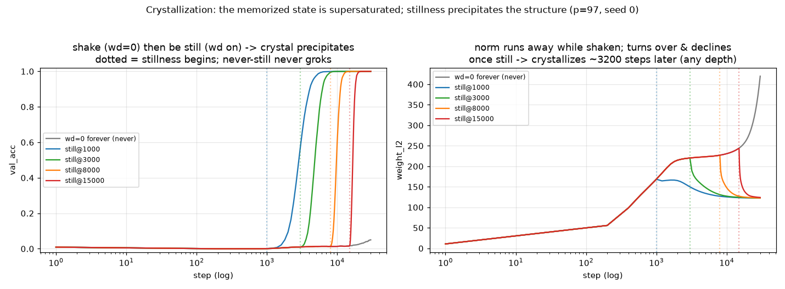

# RESULTS — crystallization (shake-then-still)

Tests the "insight" model in `docs/05-crystallization-insight.md`: is the
memorized state a **supersaturated solution** that already holds the structural
circuit dissolved in it, so that introducing **stillness** (norm reduction) late
still **precipitates the crystal** (groks)? onehot MLP, p=97, frac=0.5,
`weight_decay`=1.0 (target), seed 0. `wd_switch_step` holds wd=0 until step *T*,
then switches decay on. Data: `results/*.json`.

## Result — confirmed ✓ (with one sub-prediction corrected)

| memorize (wd=0) until *T* | ‖w‖ at *T* | groks? | val_generalize | **crystallize time = val_gen − T** |
|--------------------------:|-----------:|:------:|---------------:|-----------------------------------:|
| never (wd=0 forever) | → 420 (runs away) | **no** | — | — |
| 0 (decay from start) | 11 | yes | 3400 | 3400 |
| 1000 | 168 | yes | 4200 | **3200** |
| 3000 | 220 | yes | 6200 | **3200** |
| 8000 | 227 | yes | 11200 | **3200** |
| 15000 | 244 | yes | 18200 | **3200** |

Reading the two panels of the figure together (mirage guard: the accuracy step
and the norm turnover coincide):

- **The perpetually shaken solution never crystallizes.** wd=0 forever: val stays
  ≈0, ‖w‖ runs away to 420. Agitation without stillness → no crystal, ever.
- **Memorize first — to any depth — then be still, and the crystal precipitates.**
  Every `switch_T` run groks. At the switch the norm **turns over and declines**,
  and validation jumps. Even after memorizing for 15000 steps at ‖w‖=244, adding
  stillness precipitates the structure.
- **All crystals are the same crystal.** Every switched run settles to the *same*
  structural norm (‖w‖ ≈ 122) — the low-norm solution from `low_norm/M1`. The
  memorized state was supersaturated; stillness precipitates the one structural
  circuit dissolved in it.
- **The crystallization clock is constant (~3200 steps) and starts when stillness
  begins.** This *corrects* the pre-registered sub-prediction (`docs/05` guessed
  deeper memorization would take *longer* to crystallize, "more norm to shed").
  It does **not**: switch at 1000 or at 15000, the time from stillness to grok is
  the same ~3200 steps, despite the higher starting norm. The prior shaking
  duration does not matter; only that you eventually become still. (The
  decay-from-start run takes 3400 because it is also still fitting train early.)

## What this establishes

- The memorized (high-norm) solution is **not a dead end**: it is a
  supersaturated solution containing the structural circuit, which a settling
  (norm-reducing) pressure precipitates — reframing weight decay from "prevents
  overfitting" to "the stillness that lets an already-present structure
  crystallize out."
- It ties the arc together: shaking = norm runaway (`low_norm/M2`); stillness =
  norm reduction (`repetition_forgetting/Phase 3`); crystal = the low-norm
  per-weight-compact structural solution (`low_norm/M1`). The **ordering** result
  is new: precipitation works *after* arbitrary memorization, at a fixed rate.

## Honest scope

Single seed; onehot MLP; p=97; training-time. The analogy to the human insight
practice is a metaphor (see `docs/05` §0) — only the training-time dynamics are
load-bearing. The constant ~3200 crystallization time is one seed / one config;
a seed and hyperparameter check is owed before calling it a constant rather than
a coincidence. The "toy" half of the model (that a low-load repetitive task is
what keeps the surface occupied) is here just the fixed train set at low
post-memorization gradient; it was not independently manipulated (e.g. removing
the data gradient during the still phase) — an owed follow-up.
