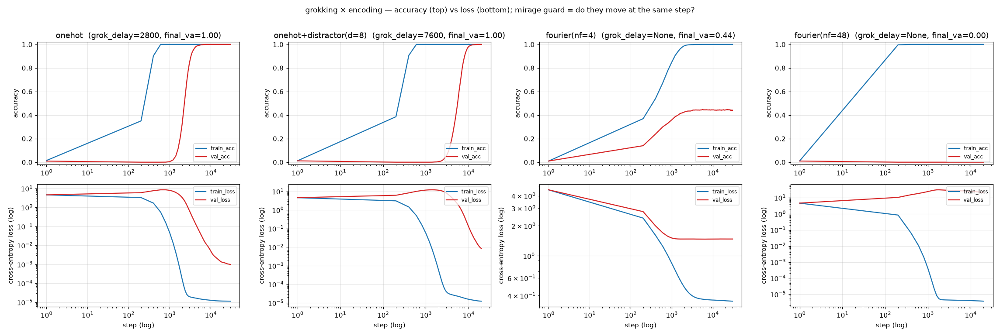

# RESULTS — grokking × encoding transparency

Measured outcomes for the experiment in
[`docs/02-experiment-design.md`](../../docs/02-experiment-design.md). Numbers are
read from the committed `results/*.json`. **Single seed (0), single `p=97`,
single MLP** — these are first cuts, not sweeps over seeds.

`metrics_version = grok-metrics-v1`. Shared across arms: `(a+b) mod 97`, 50/50
split, one-hidden-layer MLP (hidden 256), full-batch AdamW, `lr=1e-3`,
`weight_decay=1.0`, seed 0. Only the encoding (and, within the fourier sweep,
`num_freqs`) changes. `onehot` ran 30k steps; the sweep and distractor ran 20k
(onehot itself grokked by step 3400, so 20k is ample for onehot-speed grokking).

## Decision rule (mirage guard)

An arm "groks" only if **both**: `grok_delay` large and positive **and**
`val_loss` stays high through the delay then drops at the same step `val_acc`
rises. `grok_delay = None` is **ambiguous alone** — it can mean "never
generalized" *or* "val tracked train, no late jump." The curve decides; each row
says which.

## Summary table

| arm | encoding | train_sat | val_gen (≥0.90) | grok_delay | final val_acc | verdict |
|-----|----------|-----------|------------------|------------|----------------|---------|
| A | `onehot` (opaque, canonical) | 600 | 3400 | **2800** | 1.000 | **grokking, mirage-guard clean** |
| C | `onehot_distractor` (opaque + injected underdet.) | 600 | 8200 | **7600** | 1.000 | **grokking, delayed further — supports C1** |
| B0 | `fourier` nf=4 (transparent) | 2200 | — | none (no step) | 0.441 | no step, **incomplete generalization** |
| B1 | `fourier` nf=16 | 600 | — | none | 0.372 | no step, worse |
| B2 | `fourier` nf=32 | 400 | — | none | 0.027 | no step, near-total val collapse |
| B3 | `fourier` nf=48 (≈complete basis) | 200 | — | none | 0.000 | pure memorization, val_loss diverges |

## Arm A — `onehot`: grokking reproduced ✓ (harness verified)

Memorization phase (train_acc = 1.0 by step 800, val_acc = 0.000, val_loss
*rising* to a peak **8.44 @ step 600**, weight_l2 growing), then val_acc 0 → 1.0
over steps ~1200–4000 with **val_loss dropping at the same steps** (8.44 →
0.005) and weight_l2 declining from its peak (**149.6 @ 2200** → 122). Binary and
continuous metrics move together → real transition, not a mirage. Harness
trusted.

## Arm C — `onehot_distractor`: supports C1 ✓ (cleanest positive result)

Appending 8 irrelevant per-residue nuisance dims to one-hot — widening the
memorize-vs-structure gap without touching the labels — kept **full**
generalization (final val_acc 0.9998) but pushed the step **much later**:

| | onehot | onehot_distractor |
|---|---|---|
| train_sat | 600 | 600 |
| val_gen (≥0.90) | 3400 | **8200** |
| grok_delay | 2800 | **7600** |
| peak val_loss | 8.44 | **12.15** |

The delay more than doubled and the memorization-phase val_loss peak rose. The
mirage guard holds: val_loss sits at ~11–12 through the plateau, then drops (11.5
→ 0.008) exactly as val_acc climbs 0 → 1.0 over steps ~4000–12000. **More
injected underdetermination → a later, not absent, step, with full eventual
generalization.** This is the predicted C1 signature, on a single seed.

## Arm B — `fourier` (transparent): a confounded null, reported as such

The hoped-for clean test of C2 did **not** materialize. What the `num_freqs`
sweep actually shows is a *monotonic* trend, but not the predicted one:

- As `num_freqs` rises 4 → 48, **train fits faster** (train_sat 2200 → 200: more
  dimensions make memorization trivial) and **validation gets monotonically
  worse** (0.44 → 0.37 → 0.03 → 0.00).
- **No arm shows a grokking step.** At nf=4 val rises *with* train from step ~200
  (early val_acc 0.14) and plateaus at 0.44 — smooth, partial, no delay. At nf=48
  val never leaves ~0 and val_loss *diverges* (4.6 → 20.5): pure memorization.

Two honest consequences:

1. **C2 is not cleanly tested here.** At nf=4 the grokking step is absent — but
   so is full generalization (0.44). The absence of a step co-occurs with a
   failure to reach the structural solution, so we cannot separate "no step
   because the medium is transparent" from "no step because this encoding never
   supported the solution under this regularizer." The fourier operationalization
   is **inadequate** as a test of C2; it is a null, not a confirmation.

2. **A caveat in `docs/02` is refuted.** That doc noted a complete Fourier basis
   is "merely an orthogonal rotation of one-hot and would carry identical
   information." Informationally true — but nf=48 (96 dims, near-complete)
   **did not behave like one-hot at all**: one-hot grokked to 1.0, nf=48 purely
   memorized with diverging val_loss and never generalized within budget. The
   ReLU-MLP-with-weight-decay is strongly **basis-sensitive**: an
   information-preserving rotation is *not* dynamically equivalent. This is a
   real (if inconvenient) finding and is left on the record rather than tidied
   away.

### Suspected confound (hypothesis, not established)

`weight_decay=1.0` was held fixed across arms (principled for the opaque
comparison), but Fourier rows have norm ≈ √(2·nf), so the *effective*
regularization and input scale differ across the sweep and differ from one-hot.
The transparent arm may be crippled by mis-scaled regularization rather than by
transparency per se. Also, high-frequency features give the network fine-grained
memorization handles, which plausibly drives the monotonic val collapse. Both are
**hypotheses**; neither is tested here.

## What this run establishes, and does not

- **Establishes (this seed/config):**
  - The harness reproduces classic grokking under one-hot, confirmed by both
    binary and continuous metrics (not a mirage).
  - Injecting underdetermination (distractor) **lengthens** the grokking delay
    while preserving full generalization — the C1 signature.
- **Does NOT establish:**
  - C2 ("structural transparency removes the *visible step*"). The fourier arm is
    confounded: where the step vanished, generalization also failed. A fair test
    needs a transparent encoding that actually reaches high val_acc.
  - Anything about a *complete* basis matching one-hot — it did not.
- **Reservation R1 stands** throughout: this is about timing/visibility, never a
  quality verdict.
- **Single seed.** Every "delay" number is one draw; a seed sweep is future work.

## Next steps (not yet run — blank cells stay blank)

1. **Rescue the C2 test:** normalize Fourier feature scale (unit row norm) and/or
   sweep `weight_decay` for the transparent arm so it can reach high val_acc,
   *then* check whether a step appears. Only a transparent encoding that
   generalizes fully can adjudicate C2.
2. **C1 dose-response:** sweep `num_distractor` (0, 4, 8, 16, 32) and/or
   `train_frac` and check whether `grok_delay` rises monotonically with injected
   underdetermination.
3. **Seeds:** repeat A and C over ≥5 seeds to put error bars on the delays.
