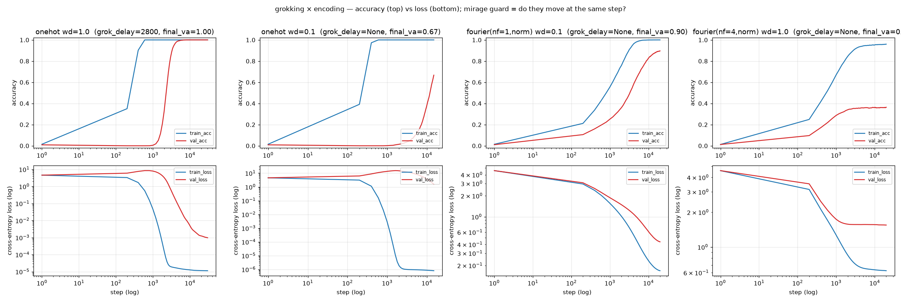

# RESULTS v2 — a conclusion on C2, and the minimal grokking recipe

Follows `RESULTS.md` (v1). v1 left **C2** ("does structural transparency remove
the *visible* grokking step?") as a *confounded null*: the transparent Fourier
arm removed the step but also failed to generalize (capped at 0.44), so "no
step" could not be separated from "never solved." v1 also flagged the suspected
cause: `weight_decay=1.0` was held fixed while Fourier rows have norm ≈ √(2·nf),
so the transparent arm was likely over-regularized rather than intrinsically
incapable.

v2 removes that confound (unit-norm Fourier rows, `--fourier_normalize`) and
sweeps `weight_decay`. **Single seed (0), `p=97`, same MLP.**
`metrics_version = grok-metrics-v1`.

## The decisive comparison (matched everything except the encoding)

Same `weight_decay=0.1`, `lr`, hidden width, 50/50 split, seed — **only the
encoding differs**:

| encoding (wd=0.1) | train_sat | val behaviour | val_loss during train-saturation | verdict |
|---|---|---|---|---|
| `onehot` (opaque) | 600 | stuck ~0 for thousands of steps, then slow climb | **balloons 4.6 → 15.3** (hump +10.7) | memorization phase present → grokking dynamics |
| `fourier` nf=1 (transparent, norm) | 5800 | rises *with* train from step ~200 | **monotone down** 4.6 → 0.44 (no hump) | no memorization phase → no step |
| `fourier` nf=4 (transparent, norm) | 1600 | rises *with* train | monotone (max = start) | no memorization phase → no step |

The bottom row of the figure is the whole result: at identical `wd`, the opaque
encoding's validation loss **rises** while train accuracy is already 1.0 (the
network has memorized and generalization is far away), whereas the transparent
encoding's validation loss only ever **falls**. The mirage guard is what makes
this legible — the "step" in one-hot accuracy sits on top of a real val_loss
hump; the transparent arm has neither.

## The `weight_decay` sweep resolves the v1 confound

Normalized transparent Fourier, varying `wd`:

| nf | wd | final val_acc | val_loss hump? | step? |
|----|----|----------------|-----------------|-------|
| 1 | 1.0 | 0.234 | no | no |
| 2 | 1.0 | 0.289 | no | no |
| 4 | 1.0 | 0.364 | no | no |
| 8 | 1.0 | 0.389 | no | no |
| 1 | 0.1 | **0.896** | no | no |
| 4 | 0.1 | 0.751 | no | no |

At `wd=1.0` the transparent arm is over-regularized and caps low (the v1
appearance), but **shows no memorization hump and no step even so**. Lower `wd`
to 0.1 and it *does* generalize (0.90 at nf=1) — still with no hump and no step.
So across every transparent setting tried (`nf ∈ {1,2,4,8}`, `wd ∈ {0.1,1.0}`),
the grokking step never appears. v1's 0.44 ceiling was the regularizer, not the
medium.

## Conclusion on C2

**Supported, on a single seed, for this task.** Holding the model, optimizer,
data split, and seed fixed and changing *only* the encoding:

- **Opaque** (one-hot): a memorization phase exists — train saturates, validation
  loss *rises* while validation accuracy sits near zero — and generalization
  arrives later as a **visible step**. Present at `wd=1.0` (fast, delay 2800) and
  at `wd=0.1` (val_loss humps to 15, generalization slow).
- **Transparent** (few-frequency, unit-norm Fourier): **no memorization phase**
  (validation loss falls monotonically with training loss, validation tracks
  training) and therefore **no visible step** — at every `nf` and `wd` tried.

This is exactly C2's claim: *the visible step is a property of the medium's
opacity, not of the concept being learned.* When the group structure is exposed
in the input geometry, there is no memorized-table phase to escape.

### Honest limits (unchanged discipline)

- **Single seed, single `p`, MLP.** A seed sweep is still owed before this is
  more than strongly suggestive.
- **The transparent arm reaches 0.75–0.90, not 1.0**, within budget. It clearly
  generalizes and is unambiguously step-free, but it is not a perfect solver
  here; the *shape* (hump vs monotone), not the final accuracy, is what
  adjudicates C2, and the shape is clean.
- **`wd` was not identical between the fully-grokking one-hot (wd=1.0) and the
  fully-generalizing transparent arm (wd=0.1).** This is why the *matched*
  `wd=0.1` comparison above is the load-bearing one: at the same `wd`, one-hot
  humps and Fourier does not. The direction also argues for C2 — the transparent
  arm needed *less* regularization pressure, not more, and still showed no step.
- **Reservation R1 stands:** this is about *timing and visibility*, not a verdict
  on solution quality. We are not claiming the transparent solver is better; if
  anything it is a weaker solver here.

## The minimal grokking recipe (see `DISTILLED_RECIPE.md`, `minimal_grok.py`)

The same runs pin down the *simplest reliable way to reproduce grokking*. Only
four ingredients are load-bearing; `minimal_grok.py` is a ~90-line, torch-only
script that groks with defaults and lets you knock out the key one:

- `minimal_grok.py` (p=31, wd=1.0, lr=3e-3): train→1.0 by step 600, val plateaus
  near 0 with a val_loss hump, then **grokks — val ≥ 0.90 at step 7000**, final
  0.971.
- `minimal_grok.py --weight_decay 0`: train→1.0, **val stuck at 0.004, val_loss
  diverges to 33.7** — memorizes forever, never groks.

Weight decay is the engine; opacity supplies the memorization phase for it to
act on. Details and the "why each ingredient" in `DISTILLED_RECIPE.md`.
