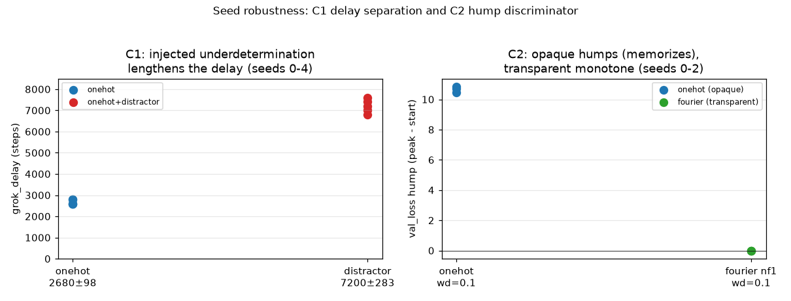

# RESULTS v3 — seed robustness

The v1/v2 results were single-seed. This round repeats the two load-bearing
contrasts across seeds to see whether they survive. `p=97`, MLP, same configs;
seeds as stated. `metrics_version = grok-metrics-v1`. Data:
`results/v3_seeds/*.json`.

## C1 — does injected underdetermination lengthen the grok delay? (seeds 0–4)

`onehot` vs `onehot_distractor` (8 nuisance dims), `weight_decay=1.0`, 20k steps.

| seed | onehot delay | distractor delay |
|------|--------------|------------------|
| 0 | 2800 | 7600 |
| 1 | 2600 | 7200 |
| 2 | 2600 | 7400 |
| 3 | 2600 | 7000 |
| 4 | 2800 | 6800 |
| **mean ± sd** | **2680 ± 98** | **7200 ± 283** |

Train saturates at step 600 in every run; final val_acc is 1.000 (onehot) /
0.999 (distractor) throughout. **The two delay distributions do not overlap** —
onehot max (2800) < distractor min (6800), a ~2.7× separation at ~10× the
within-condition spread. C1 (from v1, single seed) **holds across seeds**:
injecting underdetermination lengthens the grokking delay while preserving full
generalization — a *later*, not absent, step.

## C2 — opaque humps, transparent stays monotone (seeds 0–2)

Matched `weight_decay=0.1`, only the encoding differs. The discriminator is the
validation-loss **hump** while train_acc = 1.0 (memorization phase) vs a
**monotone** validation loss (no memorization phase). Peak − start of val_loss:

| seed | onehot wd=0.1 (opaque) val_loss hump | fourier nf=1 wd=0.1 (transparent) val_loss hump |
|------|--------------------------------------|--------------------------------------------------|
| 0 | **+10.70** (4.58 → 15.28) | **+0.00** (monotone) |
| 1 | **+10.84** (4.58 → 15.41) | **+0.00** (monotone) |
| 2 | **+10.47** (4.58 → 15.05) | **+0.00** (monotone) |

The discriminator is unanimous across seeds: the opaque encoding's validation
loss balloons by ~+10.7 (to ~15) while train_acc is already 1.0 — the
memorization phase — whereas the transparent encoding's validation loss never
rises above its starting value at all. (onehot wd=0.1 shows final val_acc ~0.25
at 8k steps because it groks *slowly* at low weight decay; the hump, not the
final accuracy, is the signature. Transparent reaches ~0.85 by 12k, still
climbing, with no hump.) **C2's shape result holds across every seed tried.**

## Honest scope

- 5 seeds for C1, 3 for the C2 hump — enough to show the effect is not a
  single-seed fluke, not enough for a tight interval. Reported as sd, not SEM,
  and not dressed up as a hypothesis test.
- Everything else (single `p`, MLP, training-time) is unchanged from v1/v2 and
  its caveats carry over.
