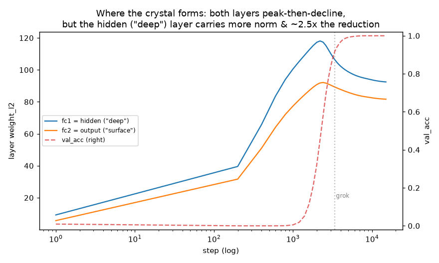

# RESULTS — where does the crystal form? (per-layer decomposition)

Prompted by the observation that networks already have layers (input / hidden /
output): is the "deep mind" where the crystal forms literally the **hidden**
layer? Standard onehot MLP, `(a+b) mod 97`, wd=1.0, lr=1e-3, seed 0.
`layers_probe.py` logs the weight norm of each layer separately.

| layer | peak ‖w‖ @ step | final ‖w‖ | norm reduction during crystallization |
|---|---|---|---|
| **fc1 — hidden ("deep")** | 118.1 @ 2200 | 92.5 | **−25.6** |
| fc2 — output ("surface") | 92.1 @ 2400 | 81.7 | −10.4 |

(train saturates @600, grok @3400.)

## Reading

- **Both layers do the "shake → still → crystal" thing.** Each peaks (~2200–2400,
  the memorization high-water mark) *before* val generalizes (3400) and then
  declines through the grok — the memorize-then-reorganize signature is not
  confined to one layer.
- **But the hidden ("deep") layer carries more of it:** higher peak norm (118 vs
  92) and **~2.5× the norm reduction** during crystallization (−25.6 vs −10.4). So
  the reorganization into the structural circuit is *concentrated more* in the
  hidden layer.
- **This partially validates "hidden = deep, where the crystal forms"** — as a
  matter of degree, not a clean split. The output layer also reorganizes; it is
  not a passive readout.

## What it does and does not license

- It supports identifying the hidden layer as *where* more of the structure
  forms. It does **not** supply the *functional* separation the meditation model
  needs (a slow, protected "deep" store vs a fast "surface"): here both layers
  train at the same rate under the same decay, and the hidden layer is **shared**
  — so an unrelated "sutra" task would still disrupt it (consistent with the toy
  test's collapse). Spatial layers ≠ timescale/plasticity separation.
- Owed follow-up (the real architectural test): give the hidden "deep" store and
  the "surface" head different plasticity/decay (fast/slow weights, or a frozen-
  vs-plastic split), and ask whether the net can then chant one task on the
  surface while a held task crystallizes in the protected deep.

Single seed; p=97; one MLP.
