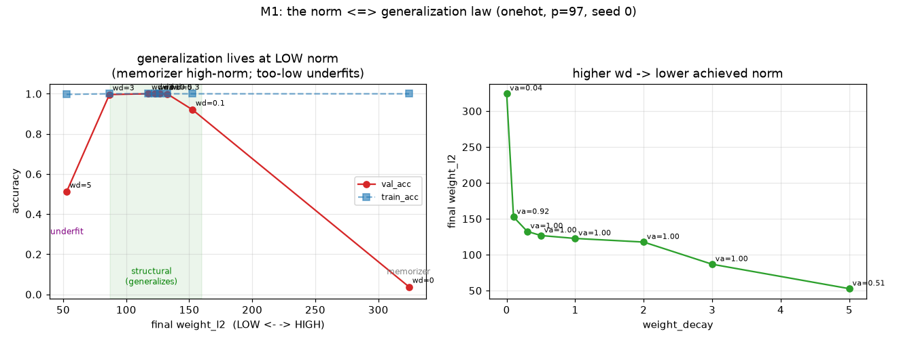
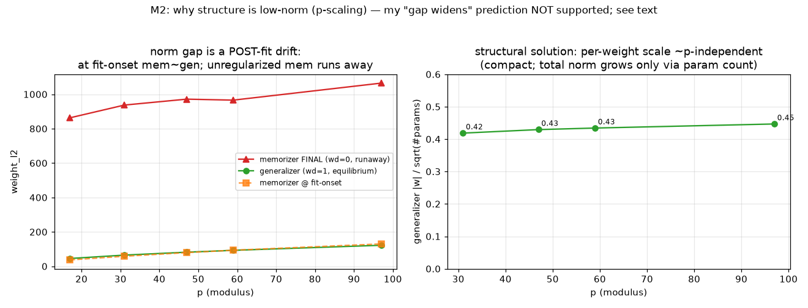

# RESULTS — low-norm ⟺ generalization

Measures the substrate under the Phase-3 result (grokking's engine is norm
reduction): is the generalizing solution actually lower-norm than the memorizer,
how tightly does generalization track norm, and **why** is structure low-norm.
Design in `docs/04-low-norm-generalization.md`. onehot MLP, seed 0. Data:
`experiments/low_norm/results/*.json`.

## M1 — the norm ⟺ generalization law (p=97) ✓

`weight_decay` sweep; each settles at a different weight norm:

| wd | final ‖w‖ | train | val | regime |
|----|----------:|------:|----:|--------|
| 0.0 | 324 | 1.000 | 0.037 | memorize (high norm, no gen) |
| 0.1 | 153 | 1.000 | 0.921 | generalize |
| 0.3 | 132 | 1.000 | 1.000 | generalize |
| 0.5 | 127 | 1.000 | 1.000 | generalize |
| 1.0 | 123 | 1.000 | 1.000 | generalize |
| 2.0 | 118 | 1.000 | 1.000 | generalize |
| 3.0 | 87 | 1.000 | 0.996 | generalize (edge) |
| 5.0 | 53 | 0.997 | 0.511 | **underfit** (norm too low to fit) |

The memorizing solution fits train at ‖w‖ ≈ 324 and does **not** generalize; the
generalizing solutions all live at **much lower norm** (‖w‖ ≈ 118–153, ~2.7×
lower); pushing the norm **too** low (wd=5, ‖w‖=53) breaks even training. So:

> **Generalization requires the weight norm driven well below the memorizer, but
> above an underfitting floor.** There is a low-norm structural band; memorization
> sits above it; underfitting below. This is exactly the substrate that makes
> "reduce the norm ⇒ generalize" (Phase 3) work.

## M2 — why is structure low-norm? (p-scaling) — prediction NOT supported; two cleaner facts instead

`docs/04` predicted the memorizer:generalizer **norm gap widens with p** (a
memorizer stores `p²` pairs; structure uses a few frequencies). **This specific
prediction was not supported.** Measured honestly (`p ∈ {17,31,47,59,97}`,
generalizer wd=1, memorizer wd=0):

- The naive ratio *memorizer-final : generalizer-final* actually **shrinks** with
  `p` (19.1 → 8.7). But that ratio rests on the `wd=0` memorizer's **final** norm,
  which is a **runaway** (it just keeps growing without decay: 863 → 1065, roughly
  `p`-independent) and is *not* a well-defined "cost of memorization." So the ratio
  is not a trustworthy quantity — as flagged in the pre-registration.

What the data *does* show cleanly, and it is arguably more informative:

1. **The norm gap is a POST-fit drift, not a fitting requirement.** At the step
   train first saturates, the memorizer's norm ≈ the generalizer's equilibrium
   norm (p=97: 130 vs 122; p=47: 79.5 vs 81.9). Memorization does **not** need
   more norm to *fit*. The gap only opens *afterwards*: unregularized, the network
   keeps inflating its norm (memorizing harder) toward ~1000; with decay it is
   held at the low-norm structural solution that also generalizes.
2. **The structural solution is compact per weight.** The generalizer's
   *per-weight* scale (‖w‖ / √#params) is ~**constant** across p (0.42, 0.43,
   0.43, 0.45 for p=31–97). Its total norm grows only because it has more
   parameters, not because each weight must be larger — the structural circuit
   uses similar-magnitude weights regardless of problem size.

(p=17 is excluded from the generalizer numbers: at that small modulus wd=1.0 is
too strong and the run did not generalize — val 0.007. An anomaly of the fixed
hyperparameters at tiny p, not a data point about structure.)

## Synthesis — refined picture of low-norm ⟺ generalization

- **M1 confirms L** at fixed p: the generalizing solution is a **low-norm**
  solution that fits, sitting far below the (runaway) memorizer and above an
  underfitting floor. This is why norm reduction selects generalization.
- **M2 corrects the naive "why."** It is **not** that memorization needs a higher
  norm to fit (at fit-onset the norms match). It is that:
  - there **exists** a low-norm, per-weight-compact structural solution that fits
    *and* generalizes;
  - left unregularized, training **drifts to ever-higher norm** (memorizing
    harder) and never reorganizes into it;
  - a downward norm pressure **holds the network in the low-norm basin**, where
    the only way to keep fitting train is the structural (generalizing) solution.
- So "low-norm ⟺ generalization" is best read as: **among train-fitting solutions,
  the low-norm ones are structural/generalizing, and the high-norm ones are
  memorizing; norm reduction is what keeps the network in the low-norm,
  structural region** — not a claim that memorizing is intrinsically norm-hungry
  at the moment of fitting.

## Honest scope

Single seed; onehot MLP; one architecture; training-time. My pre-registered
scaling prediction (gap widens with p) is a **null** and is reported as such; the
robust results are M1 (the law) and the two M2 observations (post-fit drift;
per-weight-compact structure). A seed sweep and a cleaner "minimum-norm
interpolant" measurement (rather than the runaway wd=0 norm) are owed to push
past correlational characterization.
