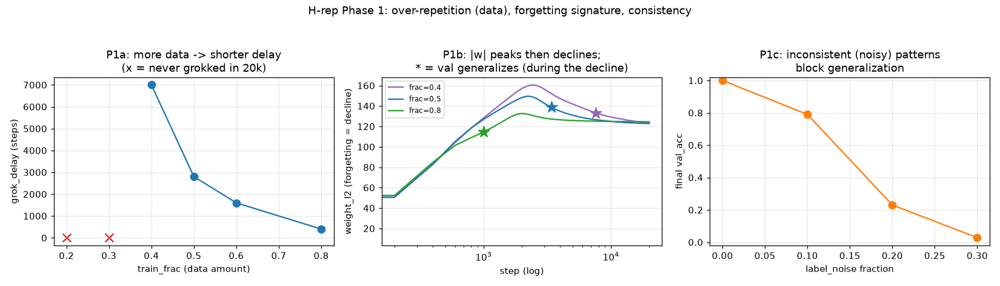
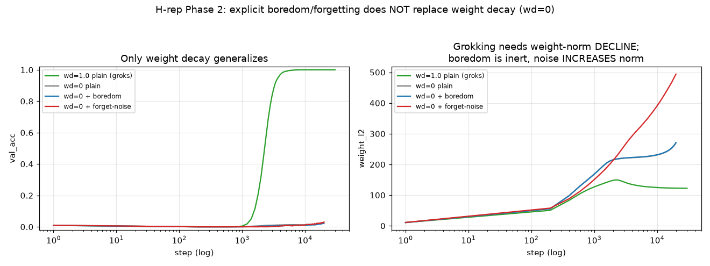
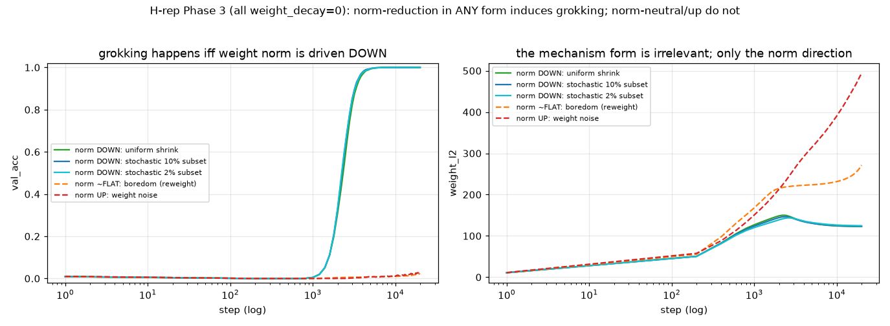

# RESULTS — Repetition & Forgetting (H-rep)

Tests the hypothesis (`docs/03-repetition-forgetting.md`) that grokking is
induced by **emphasis on repeated/consistent patterns** and **boredom &
forgetting of over-repeated patterns**. `p=97`, one-hot MLP, full-batch AdamW,
seed 0 unless noted. `metrics_version = rf-metrics-v1`. Data:
`experiments/repetition_forgetting/results/*.json`.

## Phase 1 — the emergent signatures (all single-seed)

### P1a — over-repetition of limited data lengthens/creates the step ✓

`train_frac` sweep (dataset size = the "how much is each pattern leaned on"
axis), wd=1.0, 20k steps:

| train_frac | grok_delay | final val_acc | |w| peak |
|-----------:|-----------:|--------------:|--------:|
| 0.2 | — (never) | 0.000 | 144 |
| 0.3 | — (never) | 0.291 | 162 |
| 0.4 | 7000 | 1.000 | 161 |
| 0.5 | 2800 | 1.000 | 150 |
| 0.6 | 1600 | 1.000 | 142 |
| 0.8 | 400 | 1.000 | 133 |

The grok delay **falls monotonically as data grows** (7000 → 2800 → 1600 → 400),
and below a critical fraction (~0.3–0.4) it never groks in budget. Less data ⇒
higher memorization (|w| peak) ⇒ longer or absent step. This matches the H-rep
reading "over-repetition of a limited set builds a memorized table whose
forgetting is grokking," **with the standing caveat** (`docs/03`) that on a
finite task "over-repetition of a limited set" and "small dataset" are the same
thing — this is also the known Power-et-al. dependence of grokking on data
fraction, reproduced here.

### P1b — the forgetting signature aligns with generalization ✓ (with a caveat)

`weight_l2` peaks (memorization) then declines (forgetting). Where does
generalization sit relative to the decline?

| frac | |w| peak @ step | |w| at val_generalize | val_gen step |
|-----:|----------------:|----------------------:|-------------:|
| 0.4 | 160.7 @ 2400 | 133.3 | 7600 |
| 0.5 | 149.6 @ 2200 | 138.7 | 3400 |

In the memorization-heavy regime, `|w|` peaks early and generalization arrives
**during the subsequent decline** (frac=0.4: |w| falls 160.7→133.3 before val
generalizes at 7600). The `--weight_decay 0` ablation (in `minimal_grok.py`) is
the counterfactual: no decay → `|w|` keeps rising, no decline, no grok. So the
"forgetting" half is observable and its presence/absence tracks grokking.

**Honest caveat (visible in the figure):** at high data (frac=0.8) generalization
happens *before* the |w| peak — with abundant data the model generalizes fast
and there is little memorization to forget. So "forgetting enables
generalization" is a statement about the **over-memorized (low/moderate data)
regime**, not a universal ordering. Reported, not smoothed over.

### P1c — emphasis needs consistency ✓

`label_noise` (randomize a fixed fraction of train labels: patterns repeated
every step but inconsistent with the rule), frac=0.5:

| label_noise | final val_acc |
|------------:|--------------:|
| 0.0 | 1.000 |
| 0.1 | 0.790 |
| 0.2 | 0.230 |
| 0.3 | 0.028 |

Generalization collapses monotonically with noise. Inconsistent patterns cannot
be captured by the emphasized rule — they can only be memorized — and they
progressively block grokking. Supports "emphasis on **consistently** repeated
patterns."

## Phase 2 — build the mechanism, test induction → **strong claim FAILS** ✗

Can an explicit **emphasis+boredom** (loss reweighting) or **forgetting** (weight
noise) **induce grokking at `weight_decay = 0`** — replace weight decay as the
engine? frac=0.5, 20k steps, seed 0. Every config memorizes (train_acc = 1.0):

| config | val_acc | |w| final | grokked? |
|--------|--------:|----------:|:--------:|
| wd=1.0 plain (ref) | 1.000 | 123 (peak 150 → declines) | **yes**, delay 2800 |
| wd=0 plain (ref) | 0.024 | 271 (rises) | no |
| wd=0 + boredom γ=2 | 0.025 | 270 | no |
| wd=0 + boredom γ=4 | 0.021 | 271 | no |
| wd=0 + forget-noise 0.003 | 0.030 | 275 | no |
| wd=0 + forget-noise 0.01 | 0.031 | 494 (rises faster) | no |
| wd=0 + forget-noise 0.03 | 0.002 | 1174 (train breaks: tr 0.83) | no |
| wd=1.0 + boredom γ=2 | 1.000 | 123 | yes, delay **2800** (unchanged) |

**Neither explicit mechanism induces grokking at wd=0, and boredom does not even
change the delay at wd=1.0** (2800, identical to plain). The figure shows why:

- **Grokking rides a weight-norm DECLINE.** The only run that generalizes
  (wd=1.0) is the only one whose `|w|` peaks (~150) and then *falls* (to 123).
  Every wd=0 run's `|w|` only *rises*.
- **Boredom (loss reweighting) is inert.** In full-batch training a mastered
  example already contributes ~zero gradient, so down-weighting it changes
  almost nothing — the boredom curve sits on top of the wd=0-plain curve.
- **Weight noise moves the norm the WRONG way.** Isotropic additive noise is a
  random walk that *inflates* `|w|` (494 at 0.01, 1174 at 0.03), the opposite of
  the reduction grokking needs; large noise just breaks training.

### Refined conclusion on H-rep

The metaphor is **descriptively apt but mechanistically specific**:

- Phase 1 confirms the *signatures* (over-repetition builds memorization; a
  weight-norm decline = "forgetting" accompanies the step in the over-memorized
  regime; consistency is required).
- Phase 2 falsifies the *strong constructive form*: a **generic** boredom or a
  **generic** forgetting does not induce grokking. The "forgetting" that induces
  it is specifically **norm-reducing decay toward the low-norm structural
  solution** — weight decay's particular mechanism, which exploits that the
  memorized table has higher weight norm than the structural circuit. Generic
  boredom (reweighting) and generic forgetting (isotropic noise, which *raises*
  norm) do not have this property.

So H-rep is best stated as: grokking's engine is **norm-selective forgetting**,
not boredom/forgetting in general. Phase 3 isolates *which* property of weight
decay is doing the work.

## Phase 3 — is it weight decay, or norm reduction in ANY form? → **norm reduction is the essence** ✓

Phase 2 left open whether grokking needs *weight decay specifically* or just
*norm reduction*. Test: drive the weight norm down at `weight_decay = 0` by
mechanisms that are **not** AdamW's decay and, in one case, structurally very
unlike it. frac=0.5, 20k steps, seed 0:

| mechanism (all at wd=0) | what it does each step | grok_delay | final val | |w| |
|---|---|---:|---:|---|
| uniform manual shrink (λ=1e-3) | `w *= (1−λ)` — decoupled decay by hand | 2800 | 1.000 | 150 → 123 (declines) |
| stochastic 10% subset (×0.99) | shrink a random 10% of weights | 2800 | 1.000 | 147 → 123 |
| stochastic 5% subset (×0.98) | shrink a random 5% | 2800 | 1.000 | 146 → 123 |
| **stochastic 2% subset (×0.95)** | shrink a random **2%** of weights | 2800 | 1.000 | 144 → 125 |
| stochastic 30% subset (×0.99) | shrink a random 30% | 2400 | 0.998 | 83 |
| *(Phase 2) boredom, norm-flat* | reweight loss | — | 0.02 | 270 (rises) |
| *(Phase 2) weight noise, norm-up* | add Gaussian noise | — | 0.03 | 494 (rises) |

**Every norm-reducing mechanism groks — with the same delay (~2800, matching the
AdamW baseline) and the same peak-then-decline signature.** Even "shrink a random
2% of the weights each step" — a sparse, stochastic operation with no resemblance
to smooth decay — groks *identically*. The mechanisms that leave norm flat
(boredom) or push it up (noise) do not grok at all.

**Conclusion: norm reduction is the essence.** Grokking here happens *iff the
weight norm is driven down*; the specific form (AdamW's `weight_decay`, manual
uniform shrink, or shrinking a random 2–30% subset) is irrelevant — only the
*direction* is. This is exactly what "forgetting the high-norm memorized table so
the low-norm structural circuit surfaces" predicts, now shown to be
implementation-independent.

## Bottom line

- **Descriptively (Phase 1): H-rep holds.** Over-repetition of limited data
  creates the memorization phase; a weight-norm decline ("forgetting") aligns
  with the step; consistency is required for a pattern to be emphasized as a rule.
- **Mechanistically (Phases 2–3): refined and then pinned down.** *Generic*
  boredom (reweighting, norm-flat) and *generic* forgetting (noise, norm-up) do
  **not** induce grokking. But **any norm-REDUCING mechanism does** — uniform or
  a random 2% subset — with identical delay and signature. The engine is
  **norm reduction toward the low-norm structural solution**, of which weight
  decay is one instance among many.
- **Net:** "emphasis + boredom/forgetting" describes grokking well; the *cause*
  is specifically **downward pressure on the weight norm**. Not weight decay per
  se, not boredom, not forgetting-as-noise — norm reduction, in any form.

Single seed throughout; a seed check on the headline contrasts is still owed
before these are more than strongly suggestive.
